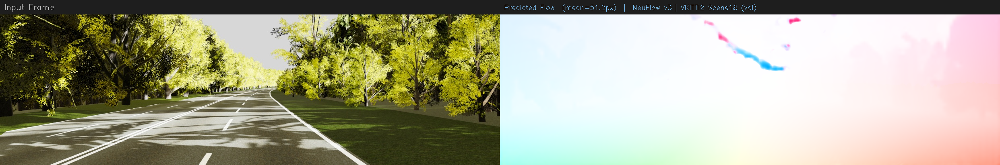
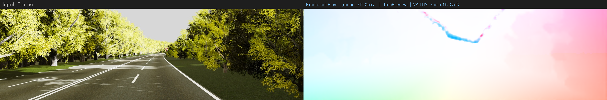
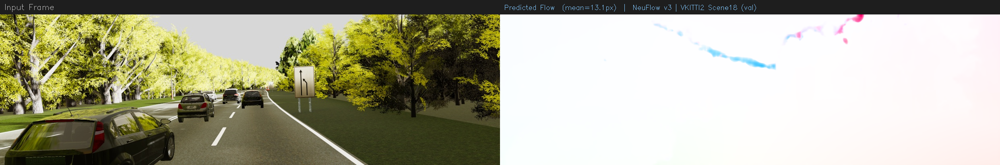
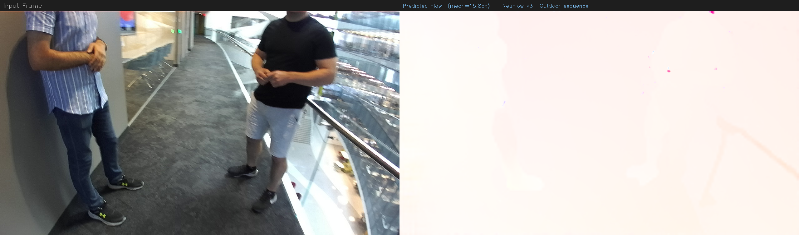
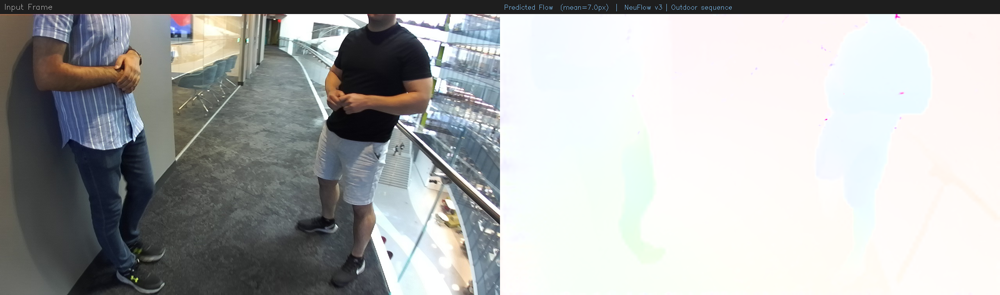

# NeuFlow v3

Built on top of [NeuFlow v2](https://arxiv.org/abs/2408.10161). The main change is replacing the convex upsampler with an implicit neural decoder, similar to what [InfiniDepth](https://arxiv.org/abs/2601.03252) does for depth estimation.

The idea: instead of blending nearby coarse flow values to upsample, query a small MLP at any pixel coordinate conditioned on multi-scale features. This lets the model predict sharper flow at boundaries and in sub-pixel detail regions.

> Training so far is only on VKITTI2 (~2100 pairs). Need FlyingChairs/Things for proper training — see notes below.

---

## What changed from v2

The backbone (CNN encoder + cross-attention + GRU refinement) is completely frozen and unchanged. Only the upsampling head is replaced.

The new decoder samples features from three scales:
- `ctx_s8` — 64d context from img0 at 1/8 res
- `feat_s8` — 128d matching features at 1/8 res  
- `feat_s16` — 128d features at 1/16 res

These get fused hierarchically (shallow → deep) using a gated residual scheme from InfiniDepth, then fed into an MLP that predicts a flow correction on top of the coarse flow. The img1 features at the warped location are also included so the decoder has cross-frame correspondence info, which InfiniDepth doesn't need (it's single-image).

Output layer is zero-initialized so at step 0 the model behaves identically to v2.

---

## Results (VKITTI2 — Scene18 + Scene20, 1174 pairs)

| | Mean EPE | Median EPE | 1px acc | 3px acc |
|---|---|---|---|---|
| NeuFlow v2 | 2.23 px | 1.08 px | 46.2% | 78.4% |
| NeuFlow v3 (step 10k) | 3.15 px | 1.87 px | 7.2% | 71.1% |

The model peaks at step 10k and then overfits — at batch size 4 and 2121 training pairs, that's already ~19 epochs. Training longer consistently makes it worse. FlyingChairs training is the obvious fix.

Checkpoint sweep:

| step | EPE |
|---|---|
| 5k | 3.29 |
| **10k** | **3.15** |
| 15k | 3.47 |
| 20k | 3.16 |
| 25k | 3.56 |
| 30k | 3.69 |

---

## Visualizations

All from `checkpoints/neuflowv3/step_010000.pth`. Left = input frame, right = predicted flow.

**VKITTI2 Scene18 (validation set):**





**Other sequences:**




---

## Training

Needs `neuflow_mixed.pth` in the project root (the pretrained v2 checkpoint).

```bash
./train_neuflowv3.sh
```

This runs 10k steps with frozen backbone, lr=2e-4 for the decoder, sparse L1 loss over 4096 random query points per image.

To eval:
```bash
python3 eval_vkitti2.py \
  --checkpoint checkpoints/neuflowv3/step_010000.pth \
  --dataset_root datasets/vkitti2 \
  --val_scenes Scene18 Scene20
```

---

## Notes

End-to-end training (unfreezing the backbone) was tried with differential learning rates (backbone 1e-5, decoder 2e-4). It completely diverged — EPE oscillating between 1px and 100px throughout training. InfiniDepth runs 800k steps on 8 GPUs to stabilize this. With a 30k budget on one GPU it doesn't work. Frozen backbone is the only stable option at this compute scale.

The 3-scale decoder is marginally better than 2-scale when stopped at the right checkpoint (3.15 vs 3.20 EPE from an earlier run), but the difference is small enough that the training data size is clearly the limiting factor.

**Next:** download FlyingChairs and FlyingThings3D and train with the standard Chairs→Things→VKITTI2 curriculum. Should push EPE below the v2 baseline.

---

## Files

```
NeuFlow/implicit_decoder.py   # the new decoder
NeuFlow/neuflow.py            # wires ctx_s8 through the pipeline
train.py                      # sparse loss, zero-init, optional diff LR
train_neuflowv3.sh            # training script (frozen backbone, 10k steps)
eval_vkitti2.py               # evaluation against GT flow
infer_v3.py                   # inference + visualization
live_plot.py                  # live training plot on localhost:5000
report.pdf                    # writeup
```

---

Based on NeuFlow v2 (Zhao et al., 2024) and InfiniDepth (Yu et al., 2025).
