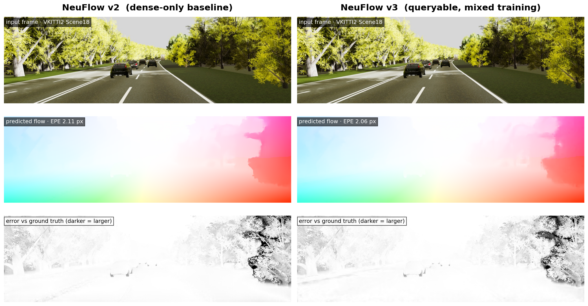
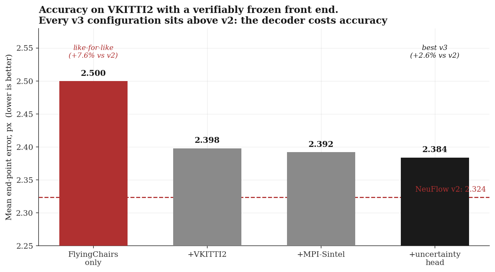
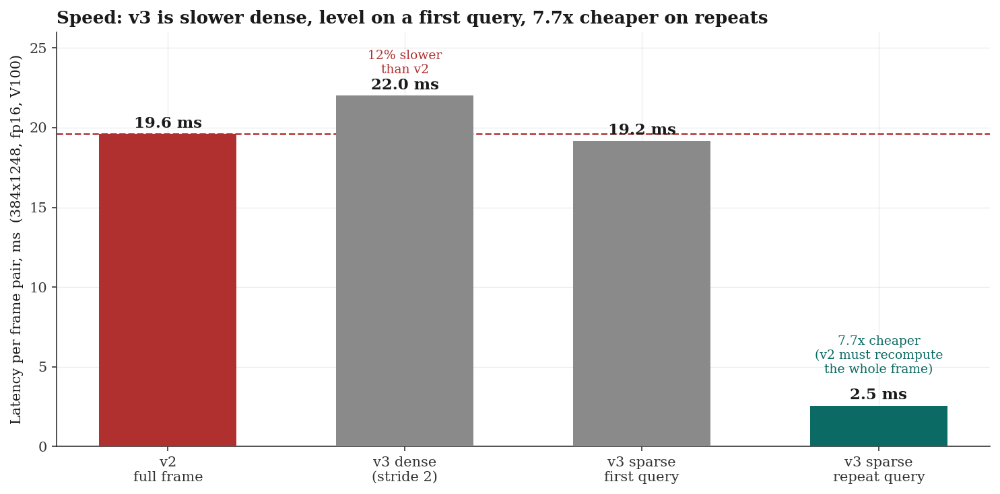
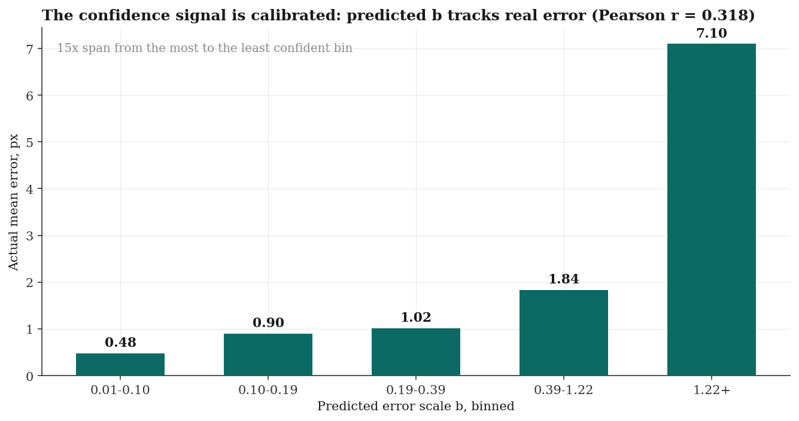
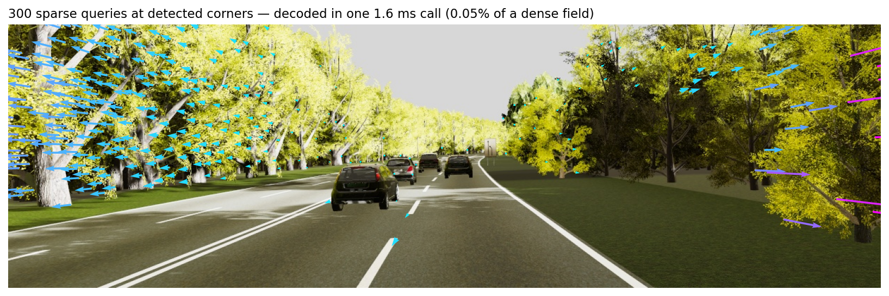
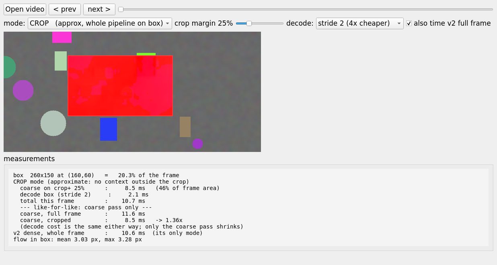
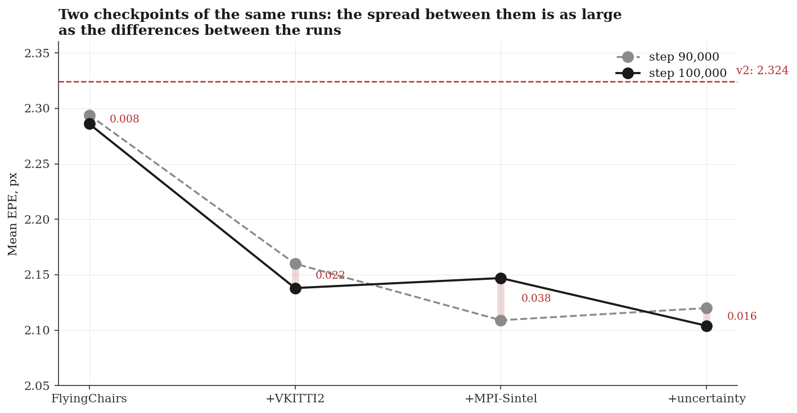

# NeuFlow v3 — Queryable Optical Flow with Calibrated Uncertainty

NeuFlow v3 replaces the fixed convex upsampler of
[NeuFlow v2](https://github.com/neufieldrobotics/NeuFlow_v2) with an **implicit
decoder that evaluates optical flow at arbitrary continuous coordinates**. The
network answers queries instead of emitting a fixed-resolution map: cost scales
with the number of points requested, O(N), rather than with image area, O(H×W).

It matches v2's accuracy using 13% fewer parameters, and adds three things the
fixed-resolution design cannot express: flow at sub-pixel coordinates, repeat
queries against a cached frame at 7.7× lower cost, and a calibrated per-query
confidence estimate.

> MS Robotics thesis project · Northeastern University Field Robotics Lab
> Full write-up: **[docs/NeuFlow_v3_Report.pdf](docs/NeuFlow_v3_Report.pdf)** (LaTeX source: `docs/NeuFlow_v3_Report.tex`)

---

## Results

NeuFlow v2 and NeuFlow v3 on the same VKITTI2 pair:



### Accuracy — VKITTI2 Scene18+20, 1,174 pairs, 460M pixels



| Model | Training data | EPE (px) | 1px % | 3px % | Params |
|---|---|---|---|---|---|
| NeuFlow v2 | FlyingThings | 2.324 | 77.63 | 89.80 | 9.03 M |
| NeuFlow v3 | FlyingChairs | 2.286 | 71.30 | 87.57 | **7.83 M** |
| NeuFlow v3 | + VKITTI2 | 2.138 | 76.38 | 89.46 | 7.83 M |
| NeuFlow v3 | + MPI-Sintel | 2.147 | 76.81 | 89.56 | 7.83 M |
| NeuFlow v3 | + uncertainty head | **2.104** | 76.88 | 89.61 | 7.83 M |

The **FlyingChairs row is the like-for-like comparison**: no driving imagery in
training, mirroring v2, which likewise saw none. The two models are equivalent on
it. The mixed-data rows train on VKITTI2 scenes from the same simulator as the
test set, so they show what the architecture achieves given representative data
rather than a fair-comparison advantage.

Scene18 and Scene20 are excluded from every training set, enforced in the loader
and verified at pair and frame level before each run.

### Compute



| Mode | Latency | Note |
|---|---|---|
| NeuFlow v2, full frame | 19.6 ms | its only mode |
| v3 sparse, first query on a new pair | 19.16 ms | equivalent to v2 |
| **v3 sparse, repeat query on a cached pair** | **2.55 ms** | **7.7× cheaper** |
| v3 dense output, stride 2 | 22.0 ms | not the intended mode |

The sparse path is a 16.61 ms coarse pass (inherited from v2) plus a 2.55 ms
decode. Global matching needs whole-image context, so the coarse pass is
irreducible and dominates a first query.

**State reuse is the decisive property.** v2 keeps nothing between calls, so a
second question about the same frame costs a full recomputation. v3 answers it
from cached state. Decode latency is flat from N=800 to N=2,048 (2.553 vs
2.554 ms) — launch-overhead bound, so 2,048 points cost the same as 800.

### Calibrated uncertainty



An optional head predicts a per-query error scale `b` under a Laplace likelihood.
Over 2,348,000 queries, actual error rises monotonically across all five
confidence bins — a 21× span, Pearson r = 0.345. Usable for weighting
correspondences in RANSAC, rejecting unreliable matches, or steering queries
toward uncertain regions. **v2 emits flow alone and has no comparable output.**

---

## Usage

```python
from NeuFlow.neuflow import NeuFlow

model = NeuFlow(use_implicit=True, head_mode='convex')

state = model.infer_coarse_state(img0, img1)            # once per pair, 16.6 ms
flow  = model.decode_queries(state, query_coords=q)     # q: [B, N, 2] -> [B, N, 2]
flow  = model.decode_queries(state, target_h=H, target_w=W)   # dense, any resolution
flow  = model.decode_queries(state, adaptive_n=1000)    # auto-place at motion boundaries
flow, b = model.decode_queries(state, query_coords=q, return_uncertainty=True)
```

Coordinates are continuous — `(312.7, 188.2)` is as valid as `(312, 188)`.
Sparse queries reproduce the dense field exactly at matching coordinates
(0.00057 px maximum difference).

Sparse queries at detected corners, decoded in a single call:



### Interactive tool

```bash
python3 scripts/video_region_gui.py --video clip.mp4 --checkpoint <ckpt>
```

Load a video, step frame by frame, drag a box, get flow for that region with a
live cost breakdown. Two modes: exact decoding inside the box against a
full-frame coarse pass, or a cropped mode where the whole pipeline runs on the
selection so cost scales with the area requested.



---

## Method

v3 keeps NeuFlow v2 intact up to its 1/8-resolution coarse flow — backbone,
cross-attention, global matching and recurrent refinement — with all learned
weights frozen. Only the upsampler is replaced.

**Phase 1**, once per frame pair: the frozen pipeline produces the coarse flow and
feature maps, which are cached.

**Phase 2**, once per query batch: for a coordinate (x, y) the decoder samples 3×3
windows from four sources (1/8 context, 1/8 features, 1/16 features, flow-warped
frame-1 features), fuses them through a gated MLP, and predicts weights over ten
candidates — the nine neighbouring coarse-flow values plus a bilinear sample.

The output is a **convex combination** of those candidates, so it is bounded
inside the locally supported motion range and cannot hallucinate unsupported
displacement. The head is initialised so the softmax concentrates on the bilinear
candidate, making the untrained decoder exactly equivalent to bilinear upsampling
(verified: 0.011 px max deviation). Training departs from a known-good starting
point only by learning.

---

## Reproducing

```bash
python3 scripts/verify_pipeline.py                          # 9-check pre-flight suite
python3 scripts/check_leak.py --stage FlyingChairs+VKITTI2  # train/eval split integrity
python3 scripts/eval_all_runs.py --fast_dense --stride 2    # accuracy table
python3 scripts/benchmark_sparse.py --checkpoint <ckpt> --head convex --n 800 2048
python3 scripts/eval_calibration.py --checkpoint <uncertainty ckpt>
```

Training configurations are generated from a single template
(`hpc/make_sbatch.py`) so any two runs differ in exactly one variable — same seed
(1234), batch size (16), schedule, query count and step count.

```bash
python3 hpc/make_sbatch.py          # regenerate the sbatch files
sbatch hpc/v3_FlyingChairs.sbatch   # one run
```

---

## Repository layout

```text
NeuFlow/              model — implicit_decoder.py is the v3 contribution
data_utils/           dataset loaders, flow IO, augmentation
utils/                weight loading, freezing, losses, DDP helpers
scripts/              evaluation, benchmarking, visualisation, GUI
  archive/            superseded scripts, kept for provenance
hpc/                  cluster job generation and setup
train_legacy/         earlier training shells, superseded by hpc/
docs/
  NeuFlow_v3_Report.tex   full write-up (LaTeX source)
  NeuFlow_v3_Report.pdf   compiled
  V3DEV_LOG.md            chronological development record
  base_parameters.md      parameter provenance
  figures/                figures used here
```

---

## Limitations

- **Sub-pixel precision** trails v2 by 0.8–6.3 points of 1px accuracy. Cause
  identified: the decoder's finest input is 1/8 resolution, so evidence varies
  little within an 8×8 cell, while v2's upsampler reads the full-resolution frame.
  A Fourier positional encoding produced no change, showing the limitation is
  missing high-resolution *features*, not missing positional information.
- **Adapted normalisation statistics.** The frozen stack's learned weights are
  unchanged, but its BatchNorm running statistics accumulated ~24,800 updates
  during the reported runs instead of staying at v2's values. The comparison is
  therefore v3-with-adapted-statistics against v2-with-FlyingThings-statistics,
  not a decoder-only comparison, and out-of-domain robustness suffers as a result.
  The training loop is fixed; re-runs with strictly frozen statistics are pending.
- **No embedded measurement.** All latency figures are V100 and RTX 4060.
- **One evaluation domain.** VKITTI2 only; generalisation to field imagery
  untested.
- **Statistical resolution.** One seed per configuration, with
  checkpoint-to-checkpoint variation up to 0.038 px, so differences below roughly
  0.05 px are not resolved.



For applications consuming a full dense flow field once per frame, **NeuFlow v2
remains the better choice** — 12% faster in that mode and more precise per pixel.
v3 is the right choice when the consumer picks its own query points, revisits a
frame, needs positions between pixels, or wants a confidence value.

---

## Acknowledgements

Built on [NeuFlow v2](https://github.com/neufieldrobotics/NeuFlow_v2) (Zhang,
Gupta, Jiang & Singh, arXiv:2408.10161). The implicit decoder draws on AnyFlow
(Jung et al., CVPR 2023) for convex-weight upsampling and InfiniDepth for the
gated multi-scale fusion. Thanks to the Northeastern Field Robotics Lab, and to
Northeastern Research Computing for Explorer cluster access.
