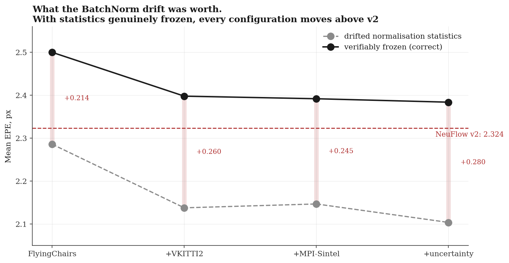
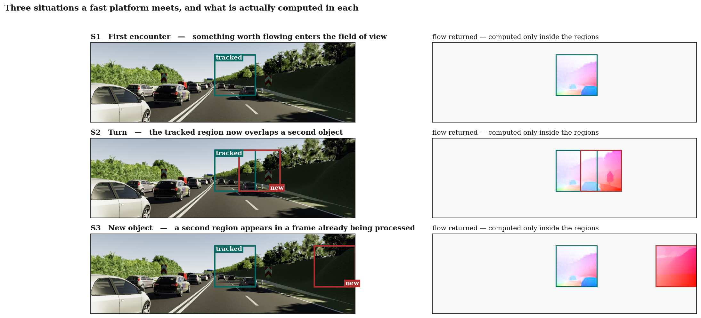
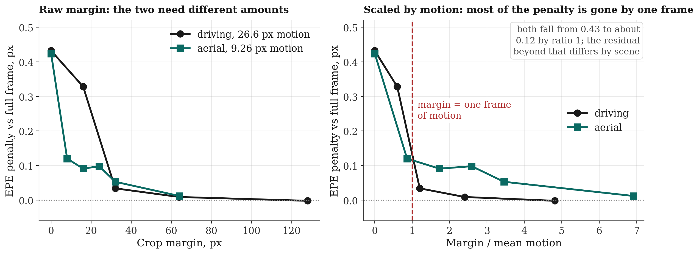
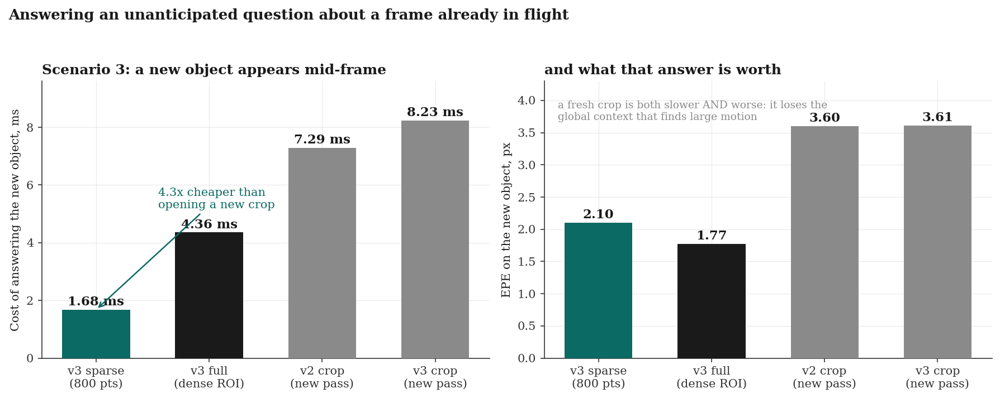

# NeuFlow v3 — Queryable Optical Flow with Calibrated Uncertainty

NeuFlow v3 replaces the fixed convex upsampler of
[NeuFlow v2](https://github.com/neufieldrobotics/NeuFlow_v2) with an **implicit
decoder that evaluates optical flow at arbitrary continuous coordinates**. The
network answers queries instead of emitting a fixed-resolution map: cost scales
with the number of points requested, O(N), rather than with image area, O(H×W).

The decoder costs accuracy: 2.384 px against v2's 2.324 px, 2.6% worse. In
exchange it adds three things v2 cannot do at all, from a model 13% smaller: flow
at sub-pixel coordinates, repeat queries against a cached frame at 7.7× lower
cost, and a calibrated per-query confidence estimate. This is a priced trade, not
a free win.

> MS Robotics thesis project · Northeastern University Field Robotics Lab
> Full write-up: **[docs/NeuFlow_v3_Report.pdf](docs/NeuFlow_v3_Report.pdf)** (LaTeX source: `docs/NeuFlow_v3_Report.tex`)

---

## Results

NeuFlow v2 and NeuFlow v3 on the same VKITTI2 pair:


### Accuracy — VKITTI2 Scene18+20, 1,174 pairs, 460M pixels


| Model | Training data | EPE (px) | 1px % | 3px % | Params |
|---|---|---|---|---|---|
| NeuFlow v2 | FlyingThings | **2.324** | **77.63** | **89.80** | 9.03 M |
| NeuFlow v3 | FlyingChairs | 2.500 | 72.81 | 87.88 | **7.83 M** |
| NeuFlow v3 | + VKITTI2 | 2.398 | 75.74 | 88.94 | 7.83 M |
| NeuFlow v3 | + MPI-Sintel | 2.392 | 75.83 | 88.98 | 7.83 M |
| NeuFlow v3 | + uncertainty head | 2.384 | 76.13 | 89.02 | 7.83 M |

**Every v3 configuration sits above v2.** The best is 2.6% worse on mean error and
1.5 points worse on 1-pixel accuracy; the like-for-like comparison (FlyingChairs
only, mirroring v2's own training) is 7.6% behind. The implicit decoder is less
accurate than the convex upsampler it replaces, and §Limitations explains why.

Both the training split and the frozen front end are verified per run: Scene18 and
Scene20 are excluded and checked at pair and frame level, and all 137 tensors
shared with v2 are confirmed bit-identical after training.



An earlier version of these results showed v3 at 2.10 to 2.29 px. Those runs had
drifting BatchNorm statistics inside the supposedly frozen stack, worth about
0.25 px. That is what made v3 appear to match v2.

### Compute


| Mode | Latency | Note |
|---|---|---|
| NeuFlow v2, full frame | 33.3 ms | its only mode |
| v3 sparse, first query on a new pair | 34.1 ms | equivalent to v2 |
| **v3 sparse, repeat query on a cached pair** | **1.25 ms** | **27× cheaper** |
| v3 dense output, stride 2 | 37.1 ms | not the intended mode |

The sparse path is a 32.8 ms coarse pass (inherited from v2) plus a 1.25 ms
decode. Global matching needs whole-image context, so the coarse pass is
irreducible and dominates a first query.

**State reuse is the decisive property.** v2 keeps nothing between calls, so a
second question about the same frame costs a full recomputation. v3 answers it
from cached state. Decode latency is flat from N=800 to N=2,048 (1.254 vs
1.285 ms), so 2,048 points cost the same as 800.

### Flowing only part of the frame

A fast platform cannot afford full-frame flow every frame. Three situations it
meets, and what the model actually computes in each:



Cropping to a region keeps full resolution where you are looking and spends
nothing elsewhere:

| Region processed | Area | Latency | Speedup | EPE in region |
|---|---|---|---|---|
| Full frame | 100% | 33.3 ms | 1.0× | 0.657 |
| Region, no margin | 7.9% | 7.8 ms | 4.3× | 1.089 |
| **Region + 32 px margin** | **13.8%** | **7.6 ms** | **4.4×** | **0.691** |
| Region + 64 px margin | 20.1% | 8.1 ms | 4.1× | 0.667 |
| Region + 128 px margin | 34.2% | 9.9 ms | 3.4× | 0.655 |

Processing 14% of the frame costs 0.034 px and runs 4.4× faster. The margin is
not optional: with none, error rises 65% and a quarter of large-motion pixels
fail, because global matching loses the context it needs. Past 32 px nothing
improves.

**Design rule: margin ≈ expected inter-frame motion ≈ speed ÷ frame rate.**
Verified across two motion scales:



| Domain | Mean motion | Margin needed | Penalty there |
|---|---|---|---|
| Driving | 26.6 px | ~32 px | +0.034 px |
| Aerial | 9.26 px | ~8 px | +0.120 px |

Both start at the same 0.43 px penalty with no margin and shed most of it once
the margin reaches one frame of motion, so the requirement is set by
displacement rather than image size and can be sized from speed and frame rate
in advance. Note this applies to any flow network — it is a platform technique,
not a property of the decoder.

**A new object appearing mid-frame** is the case specific to this architecture:



| Policy | Cost of the new object | EPE on it |
|---|---|---|
| **v3, sparse queries (800 pts)** | **1.68 ms** | 2.10 px |
| v3, dense ROI | 4.36 ms | 1.77 px |
| v2, new crop | 7.29 ms | 3.60 px |
| v3, new crop | 8.23 ms | 3.61 px |

The coarse pass is cached, so the decoder answers for 1.68 ms. A cropped pipeline
runs an entire new pass and is less accurate doing it. v2 keeps no state between
calls. Two disjoint crops cost more than one full frame, so: **crop once, or not
at all.**

### Calibrated uncertainty


An optional head predicts a per-query error scale `b` under a Laplace likelihood.
Over 2,348,000 queries, actual error rises monotonically across all five
confidence bins, a 15× span, Pearson r = 0.318. Usable for weighting
correspondences in RANSAC, rejecting unreliable matches, or steering queries
toward uncertain regions. **v2 emits flow alone and has no comparable output.**

---

## Usage

```python
from NeuFlow.neuflow import NeuFlow

model = NeuFlow(use_implicit=True, head_mode='convex')

state = model.infer_coarse_state(img0, img1)            # once per pair, 16.6 ms
flow  = model.decode_queries(state, query_coords=q)     # q: [B, N, 2] -> [B, N, 2]
flow  = model.decode_queries(state, target_h=H, target_w=W)   # dense, any resolution
flow  = model.decode_queries(state, adaptive_n=1000)    # auto-place at motion boundaries
flow, b = model.decode_queries(state, query_coords=q, return_uncertainty=True)
```

Coordinates are continuous — `(312.7, 188.2)` is as valid as `(312, 188)`.
Sparse queries reproduce the dense field exactly at matching coordinates
(0.00057 px maximum difference).

Sparse queries at detected corners, decoded in a single call:


### Interactive tool

```bash
python3 scripts/video_region_gui.py --video clip.mp4 --checkpoint <ckpt>
```

Load a video, step frame by frame, drag a box, get flow for that region with a
live cost breakdown. Two modes: exact decoding inside the box against a
full-frame coarse pass, or a cropped mode where the whole pipeline runs on the
selection so cost scales with the area requested.


---

## Method

v3 keeps NeuFlow v2 intact up to its 1/8-resolution coarse flow — backbone,
cross-attention, global matching and recurrent refinement — with all learned
weights frozen. Only the upsampler is replaced.

**Phase 1**, once per frame pair: the frozen pipeline produces the coarse flow and
feature maps, which are cached.

**Phase 2**, once per query batch: for a coordinate (x, y) the decoder samples 3×3
windows from four sources (1/8 context, 1/8 features, 1/16 features, flow-warped
frame-1 features), fuses them through a gated MLP, and predicts weights over ten
candidates — the nine neighbouring coarse-flow values plus a bilinear sample.

The output is a **convex combination** of those candidates, so it is bounded
inside the locally supported motion range and cannot hallucinate unsupported
displacement. The head is initialised so the softmax concentrates on the bilinear
candidate, making the untrained decoder exactly equivalent to bilinear upsampling
(verified: 0.011 px max deviation). Training departs from a known-good starting
point only by learning.

---

## Reproducing

```bash
python3 scripts/verify_pipeline.py                          # 9-check pre-flight suite
python3 scripts/check_leak.py --stage FlyingChairs+VKITTI2  # train/eval split integrity
python3 scripts/eval_all_runs.py --fast_dense --stride 2    # accuracy table
python3 scripts/benchmark_sparse.py --checkpoint <ckpt> --head convex --n 800 2048
python3 scripts/eval_calibration.py --checkpoint <uncertainty ckpt>
```

Training configurations are generated from a single template
(`hpc/make_sbatch.py`) so any two runs differ in exactly one variable — same seed
(1234), batch size (16), schedule, query count and step count.

```bash
python3 hpc/make_sbatch.py          # regenerate the sbatch files
sbatch hpc/v3_FlyingChairs.sbatch   # one run
```

---

## Repository layout

```text
NeuFlow/              model — implicit_decoder.py is the v3 contribution
data_utils/           dataset loaders, flow IO, augmentation
utils/                weight loading, freezing, losses, DDP helpers
scripts/              evaluation, benchmarking, visualisation, GUI
  archive/            superseded scripts, kept for provenance
hpc/                  cluster job generation and setup
train_legacy/         earlier training shells, superseded by hpc/
docs/
  NeuFlow_v3_Report.tex   full write-up (LaTeX source)
  NeuFlow_v3_Report.pdf   compiled
  V3DEV_LOG.md            chronological development record
  base_parameters.md      parameter provenance
  figures/                figures used here
```

---

## Limitations

- **Accuracy.** The decoder is less accurate than the upsampler it replaces: 2.6%
  worse on mean error at best, 7.6% like-for-like. Cause identified: the decoder's
  finest input is 1/8 resolution, so evidence varies little within an 8×8 cell,
  while v2's upsampler reads the full-resolution frame. A Fourier positional
  encoding produced no change, showing the limitation is missing high-resolution
  *features*, not missing positional information.
- **Sub-pixel querying is closer to interpolation than inference** for the same
  reason. The interface is exact and the mechanism is real, but queries inside one
  8×8 cell see nearly identical evidence, so the extra information returned
  between pixels is small until the decoder gets full-resolution features.
- **No embedded measurement.** All latency figures are from a laptop RTX 4060.
- **One evaluation domain.** VKITTI2 only; generalisation to field imagery
  untested.
- **Statistical resolution.** One seed per configuration, with
  checkpoint-to-checkpoint variation up to 0.038 px, so differences below roughly
  0.05 px are not resolved.

For applications consuming a full dense flow field once per frame, **NeuFlow v2 is
the better choice on every axis**: more accurate, and 11% faster in that mode. v3
earns its place when the consumer picks its own query points, revisits a frame,
needs positions between pixels, or wants a confidence value, and when 2.6% of mean
accuracy is an acceptable price.

---

## Acknowledgements

Built on [NeuFlow v2](https://github.com/neufieldrobotics/NeuFlow_v2) (Zhang,
Gupta, Jiang & Singh, arXiv:2408.10161). The implicit decoder draws on AnyFlow
(Jung et al., CVPR 2023) for convex-weight upsampling and InfiniDepth for the
gated multi-scale fusion. Thanks to the Northeastern Field Robotics Lab, and to
Northeastern Research Computing for Explorer cluster access.
